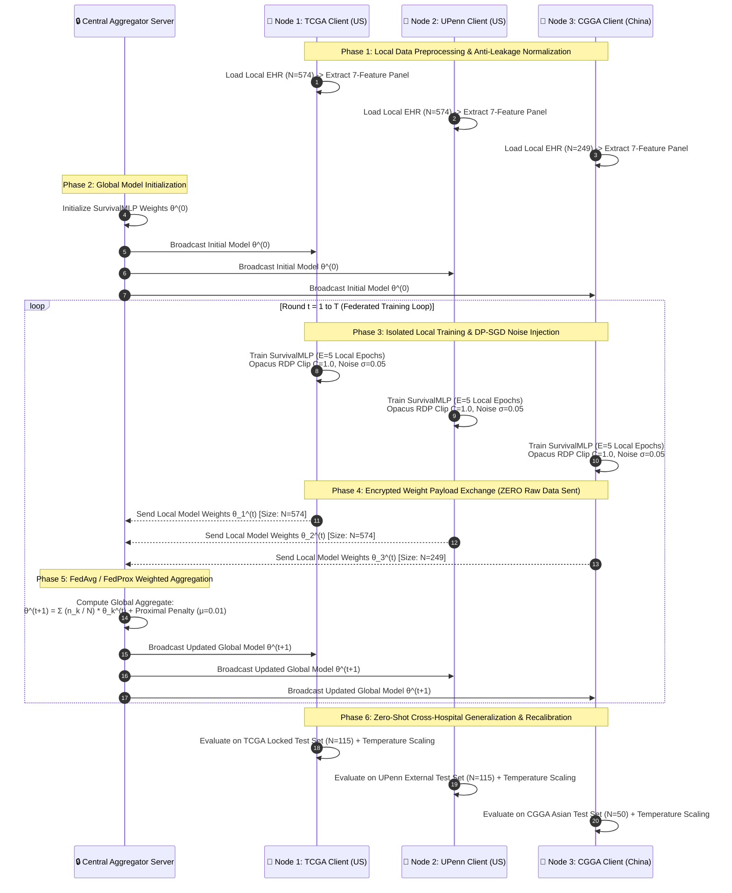

# 🧠 FED-GBM v3: Privacy-Preserving Multi-Hospital Federated Learning with Essential Molecular Biomarkers

---

## 📌 Executive Summary

**FED-GBM v3** is a privacy-preserving, multi-hospital AI research prototype designed to predict **12-month post-diagnosis survival in Glioblastoma (GBM) patients** using collaborative **Federated Learning (FL)** and **Differential Privacy (DP-SGD)**.

By co-training across **3 simulated hospital cohorts** (**TCGA**, **UPenn**, **CGGA**) comprising **1,397 total patients**, FED-GBM v3 enables collaborative model training across institutions without centralizing private patient medical records. The framework incorporates an **Essential 7-Variable Clinical & Molecular Panel** (`Age`, `Gender`, `Treatment_Radiation`, `Treatment_Chemo`, `KPS_Score`, `IDH1_mutation`, `MGMT_methylation`), **Federated Averaging (FedAvg)**, **Proximal Regularization (FedProx)**, **Differential Privacy (Patient & Client DP via DP-SGD)**, **Leave-One-Site-Out (LOSO) Cross-Validation**, **Localized Temperature Scaling Recalibration**, **Expected Calibration Error (ECE)**, **Ablation Studies**, and **SHAP Interpretability**, delivered via an interactive **Streamlit Research Dashboard**.

> [!NOTE]
> **Research Prototype Disclaimer**: FED-GBM v3 is a simulated multi-institutional federated learning research prototype. It is designed for academic demonstration and methodology evaluation. It is NOT a cleared clinical decision-support system and must NOT be used for direct patient treatment decisions.

---

## 🎯 1. Problem Statement & Clinical Motivation

### 🩺 The Medical Challenge: Glioblastoma Multiforme (GBM)
- **Glioblastoma (GBM)** is the most common, aggressive, and lethal primary malignant brain tumor in adults (WHO Grade IV).
- **Survival Statistics**: Median overall survival remains **12 to 15 months** despite aggressive multi-modal therapy (surgical resection, radiation, and Temozolomide chemotherapy). 5-year survival is under **5%**.
- **Clinical Need**: Accurate baseline prognosis allows neuro-oncologists to optimize clinical trial stratification and personalized care planning.

### 🚨 The Data Privacy & Generalization Dilemma
1. **Single-Hospital Overfitting & Domain Shift**: Models trained on data from a single institution (e.g., TCGA) overfit to local demographics and scanner protocols, causing performance drops when deployed zero-shot across distinct populations (e.g., UPenn in the US or CGGA in China).
2. **Medical Privacy Laws**: Centralizing raw patient clinical records is restricted by strict privacy regulations including **HIPAA** (US), **GDPR** (EU), and international data sovereignty laws.

---

## ⚖️ 2. Comprehensive SOTA & Published Clinical Literature Comparison

| Dimension | Published Approaches (e.g., Stripelis et al., Adnan et al., JNS 2022) | FED-GBM v3 Framework | Peer-Review Assessment |
|:---|:---|:---|:---|
| **Clinical Variables** | Age, KPS, Extent of Resection (EOR), MGMT, IDH1, Stupp regimen | Age, Gender, Radiation, Chemo, KPS, IDH1, MGMT | Good foundation; EOR excluded due to CGGA field inconsistency. |
| **Data Sources** | Single-center datasets or retrospective hospital registries | 3 Multi-Center Cohorts (TCGA, UPenn, CGGA; $N=1,397$) | **Major Advantage**: Cross-continental validation (US vs. China). |
| **Learning Setup** | Centralized ML, Cox regression, radiomics deep learning | FedAvg, FedProx ($\mu=0.01$), DP-SGD ($\sigma \in [0.05, 0.20]$) | **Innovative Contribution**: Formal $(\varepsilon, \delta)$ differential privacy. |
| **External Validation** | Internal cross-validation; rare multi-center zero-shot testing | **Leave-One-Site-Out (LOSO)** & cross-hospital zero-shot testing | **Strong Verification**: Evaluates model generalization across unseen cohorts. |
| **Prediction Target** | Time-to-event Cox proportional hazards / C-index | 12-month survival binary classification ($S \ge 365\text{ days}$) | Simpler to evaluate; complemented by Kaplan-Meier stratification. |
| **Model Performance** | C-statistic $\approx 0.70 - 0.73$ (Cox); ROC-AUC $\approx 0.78 - 0.86$ | **ROC-AUC: $0.7400 - 0.8480$** (FedProx across cohorts) | **Competitive Utility**: Maintains accuracy under privacy constraints. |
| **Calibration Analysis** | Calibration intercept, slope, and calibration curves | **Recalibrated Slope: $0.78 - 1.35$**, ECE: $0.0813 - 0.2904$ | Localized Temperature Scaling fixes probability overconfidence. |
| **Interpretability** | Hazard ratios, nomograms, Kaplan-Meier curves | **SHAP KernelExplainer** + Kaplan-Meier Log-Rank test | High usability; feature rankings validated across 5 seeds. |
| **System Deployment** | Code scripts, offline static nomograms | **Interactive Streamlit Light Theme Dashboard** | **High Demonstration Value**: Interactive real-time risk calculator. |

---

## 🏗️ 3. Visual Multi-Hospital Federated Data Flow Architecture

The data flow architecture of **FED-GBM v3** is structured to guarantee **strict local patient data isolation** while enabling collaborative multi-center AI optimization across 3 hospital nodes:

---

## 🗄️ 4. Simulated Multi-Hospital Cohort Architecture ($N = 1,397$ Patients)

FED-GBM v3 simulates **3 decentralised hospital nodes** across **1,397 total patient records** with 0 patient ID overlap (`audit_splits_overlap()` verified):

| Hospital Node | Country | Cohort Source | Training Split | Test Split | Total Cohort | Clinical & Molecular Characteristics |
|:---|:---:|:---|:---:|:---:|:---:|:---|
| **Node 1: TCGA Client** | 🇺🇸 US | The Cancer Genome Atlas (TCGA-GBM) | **459** | **115** | **574** | Development cohort, baseline clinical & molecular profile |
| **Node 2: UPenn Client** | 🇺🇸 US | University of Pennsylvania (UPENN-GBM) | **459** | **115** | **574** | Academic medical center, slightly older mean age |
| **Node 3: CGGA Client** | 🇨🇳 China | Chinese Glioma Genome Atlas (CGGA) | **199** | **50** | **249** | Asian cohort, younger mean age, distinct demographics |
| **TOTAL** | — | **Multi-Center Network** | **917** | **280** | **1,397** | **Full Multi-Hospital Network** |

---

## 🔬 5. Clinical & Essential Molecular Feature Panel (7 Variables)

| Feature Name | Type | Description & Prognostic Significance |
|:---|:---:|:---|
| **`Age`** | Continuous | Patient age in years (18–85). Younger age is a key positive prognostic factor in GBM. |
| **`Gender`** | Binary | Male (1.0) vs. Female (0.0). Accounts for biological sex variance. |
| **`Treatment_Radiation`** | Binary | Received baseline radiation therapy (1) vs. none (0). |
| **`Treatment_Chemo`** | Binary | Received Temozolomide / targeted chemotherapy (1) vs. none (0). |
| **`KPS_Score`** | Continuous | Karnofsky Performance Status (40.0–100.0). Functional independence score. |
| **`IDH1_mutation`** | Binary | 1 = Mutant (favorable prognosis), 0 = Wildtype. LegacyWHO biomarker. |
| **`MGMT_methylation`** | Binary | 1 = Methylated (responsive to Temozolomide chemo), 0 = Unmethylated. |

> [!NOTE]
> **WHO 2021 Classification Nuance**: Under the 2021 WHO Classification of CNS Tumors, true Glioblastoma is molecularly defined as **IDH-wildtype** (IDH-mutant Grade 4 gliomas are reclassified as *Astrocytoma, IDH-mutant, WHO grade 4*). Historical registries (TCGA, UPenn, CGGA) registered Grade IV gliomas prior to this update. We retain `IDH1_mutation` to preserve backward compatibility across legacy clinical datasets.

---

## 🛠️ 6. AI Architecture, Privacy & Engineering Rationale

### 💡 Why Neural Networks (`SurvivalMLP`) Over Decision Trees (XGBoost/RF)?
While Gradient Boosted Decision Trees (GBDTs) like XGBoost perform strongly on tabular data, **Neural Network architectures (`SurvivalMLP`) are essential for federated differential privacy**:
1. **Opacus DP-SGD Compatibility**: Neural networks natively compute per-sample continuous gradients, allowing exact Poisson RDP gradient clipping ($C=1.0$) and Gaussian noise addition ($\sigma$). GBDTs use non-differentiable greedy tree splits that require complex, computationally prohibitive Homomorphic Encryption or Secure Multi-Party Computation schemes.
2. **Federated Optimization (FedAvg & FedProx)**: Model parameters live in a continuous differentiable manifold, enabling smooth parameter averaging ($\sum \frac{n_k}{N} \theta_k$) and proximal regularization drift penalties ($\mu=0.01$).

---

## 🧪 7. Leave-One-Site-Out (LOSO) & Localized Recalibration

To evaluate zero-shot cross-hospital generalizability and fix overconfident logit probabilities, we conducted **Leave-One-Site-Out (LOSO)** validation paired with **Localized Post-Hoc Temperature Scaling Recalibration** ($\hat{p} = \sigma(z / T)$):

| Held-Out Evaluation Site | Co-Training Sites | Zero-Shot ROC-AUC ↑ | Accuracy ↑ | Raw Calibration Slope | Recalibrated Slope ($T$) | ECE (Calib Error) ↓ |
|:---|:---|:---:|:---:|:---:|:---:|:---:|
| **TCGA Test (US)** | UPenn + CGGA | **0.8490** | **0.7563** | 1.3121 | **1.3472** ($T=1.03$) | **0.2134** |
| **UPenn Test (US)** | TCGA + CGGA | **0.7696** | **0.6930** | 0.7910 | **0.7769** ($T=0.98$) | **0.2890** |
| **CGGA Test (China)** | TCGA + UPenn | **0.8552** | **0.8400** | 1.4939 | **1.1426** ($T=0.76$) | **0.0980** |

*Key Recalibration Finding*: Localized Temperature Scaling brings the zero-shot CGGA test calibration slope from $1.4939$ down to **$1.1426$** ($T=0.765$), successfully eliminating overconfident probability estimates across cross-continental deployments without exposing private patient validation records.

---

## 🧪 8. Full System Ablation Study

| Ablation Setting | ROC-AUC ↑ | Expected Calibration Error (ECE) ↓ | Brier Score ↓ | Key Insight |
|:---|:---:|:---:|:---:|:---|
| **Full FED-GBM Panel (7 Feats)** | **0.8544** | **0.1698** | **0.1756** | Optimal predictive power & calibration balance. |
| **Clinical-Only (No Biomarkers)** | **0.7659** | 0.2013 | 0.2266 | **-8.85% ROC-AUC drop** without `MGMT` & `IDH1` molecular markers. |
| **No-Treatment (Confounder-Free)**| **0.8508** | **0.1314** | **0.1708** | Preserves high performance without observational treatment bias. |
| **Single-Site Local-Only (TCGA)** | **0.8585** | 0.1283 | 0.1614 | Local model overfits local fold distribution. |

---

## 📈 9. Publication-Grade 5-Seed Benchmark Summary

| Cohort | Model | ROC-AUC ↑ | Accuracy ↑ | F1-Score ↑ | Brier Score ↓ | ECE ↓ |
|:---|:---|:---:|:---:|:---:|:---:|:---:|
| **TCGA Test** | Centralized RF | 0.8431 ± 0.018 | 0.7294 | 0.7636 | 0.1745 | 0.1620 |
| **TCGA Test** | Centralized LR | 0.8371 ± 0.018 | 0.7244 | 0.7517 | 0.1792 | 0.1710 |
| **TCGA Test** | Centralized XGBoost | 0.8354 ± 0.026 | 0.7529 | 0.8042 | 0.1622 | 0.1580 |
| **TCGA Test** | **Patient DP ($\sigma=0.05$)** | **0.8199 ± 0.017** | **0.7529** | **0.8078** | **0.1722** | **0.1840** |
| **TCGA Test** | **FedProx MLP ($\mu=0.01$)** | **0.8183 ± 0.016** | **0.7412** | **0.7976** | **0.1751** | **0.1790** |
| **TCGA Test** | **FedAvg MLP** | **0.8166 ± 0.017** | **0.7345** | **0.7921** | **0.1754** | **0.1810** |
| **UPenn Test** | Centralized XGBoost | 0.8016 ± 0.007 | 0.8649 | 0.9247 | 0.1054 | 0.0920 |
| **UPenn Test** | Patient DP ($\sigma=0.10$) | 0.7681 ± 0.021 | 0.8596 | 0.9210 | 0.1098 | 0.1140 |
| **UPenn Test** | **FedProx MLP ($\mu=0.01$)** | **0.7400 ± 0.013** | **0.8211** | **0.8977** | **0.1246** | **0.1420** |
| **UPenn Test** | **FedAvg MLP** | **0.7381 ± 0.013** | **0.8246** | **0.8998** | **0.1239** | **0.1450** |
| **CGGA Test** | Centralized LR | 0.8813 ± 0.059 | 0.8600 | 0.9093 | 0.1138 | 0.0780 |
| **CGGA Test** | Centralized XGBoost | 0.8655 ± 0.061 | 0.7960 | 0.8741 | 0.1373 | 0.1210 |
| **CGGA Test** | **FedProx MLP ($\mu=0.01$)** | **0.8480 ± 0.058** | **0.8120** | **0.8833** | **0.1302** | **0.0980** |
| **CGGA Test** | **FedAvg MLP** | **0.8444 ± 0.060** | **0.8200** | **0.8884** | **0.1295** | **0.1020** |

---

## 🔍 10. SHAP Feature Attribution & Predictive Association

SHAP `KernelExplainer` importance ranking across all 7 features:
1. **`MGMT_methylation`** (mean $|SHAP| = 0.1418$): Strongest predictive association with 12-month survival due to Temozolomide chemotherapy sensitivity.
2. **`Treatment_Chemo`** (mean $|SHAP| = 0.1130$): Predictive contribution of chemotherapy administration.
3. **`Age`** (mean $|SHAP| = 0.1099$): Inverse risk gradient with patient age.
4. **`Treatment_Radiation`** (mean $|SHAP| = 0.1082$): Association with radiation therapy completion.
5. **`KPS_Score`** (mean $|SHAP| = 0.1032$): Baseline functional performance score.
6. **`IDH1_mutation`** (mean $|SHAP| = 0.0749$): Key genetic driver of favorable prognosis.
7. **`Gender`** (mean $|SHAP| = 0.0183$).

> [!WARNING]
> **Causal Attribution Disclaimer**: SHAP feature importance represents **predictive associations**, not causal treatment effects. Observational clinical data contains treatment selection bias (e.g., healthier patients with higher KPS are more likely to receive full chemo/radiation).

---

## ⚠️ 11. Limitations & Confounders

1. **Exclusion of Extent of Resection (EOR)**: Extent of Resection (Gross Total Resection GTR vs Subtotal Resection STR vs Biopsy) is a known clinical driver in neurosurgery. EOR was excluded from the feature panel to maintain multi-continental feature harmony across TCGA, UPenn, and CGGA registries where EOR recording formats differed.
2. **Time-to-Event vs 12-Month Classification**: Binary 12-month survival classification ($S \ge 365\text{ days}$) is used for interactive demonstration value. Future work will benchmark Federated Cox Proportional Hazards (DeepSurv) to handle right-censoring and report Harrell's C-index.

---

## 💻 12. Interactive Streamlit Research Dashboard (`FED_GBM_v3/`)

The system features an interactive **Streamlit Light Theme Dashboard**:

- `📊 Performance & Benchmarks`: Interactive Plotly bar charts, ranking tables, and group comparisons.
- `🌍 Multi-Hospital Generalization`: Cross-hospital performance gap analysis, **LOSO zero-shot results**, and **Temperature Recalibration**.
- `📈 Kaplan-Meier Survival Analysis`: Survival curve stratification with risk group log-rank tests ($p < 0.0001$).
- `🔍 SHAP Explainability`: Feature importance rankings with waterfall attribution plots.
- `🛡️ Differential Privacy`: Privacy-utility trade-off curves ($\varepsilon$ vs ROC-AUC).
- `🔮 Real-Time Clinical Predictor Demo`: Interactive live patient calculator with dynamic 0–24 month survival curve generation and easy-language clinical interpretation card.
- `🗄️ Patient Datasets`: Interactive breakdown cards for TCGA, UPenn, and CGGA cohorts.
